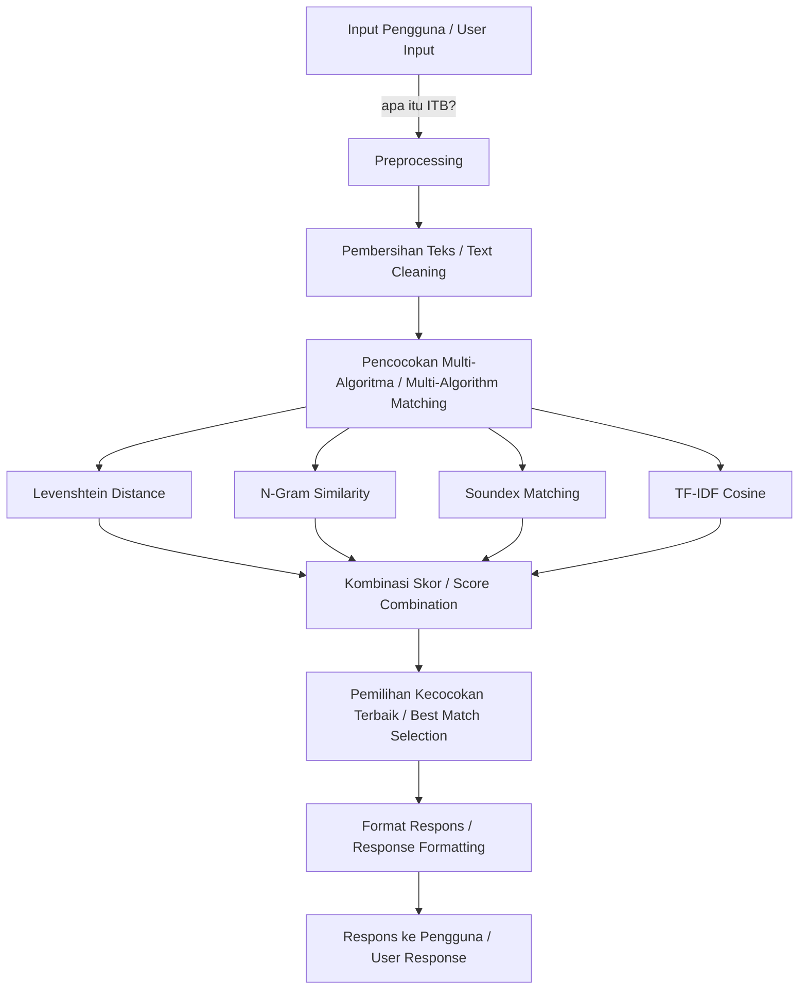

<div align="center">

# ITB CHATBOT

**Implementasi Normalisasi Teks, Regex, dan Algoritma String Matching dalam Chatbot Informasi Khusus Institut Teknologi Bandung untuk Sistem Deteksi Intent Pengguna**

*Implementation of Text Normalization, Regex, and String Matching Algorithms in a Chatbot for Institut Teknologi Bandung Information with User Intent Detection System*

[](https://python.org)
[](https://reactjs.org)
[](https://flask.palletsprojects.com)
[](LICENSE)

</div>

---

## Penjelasan Umum Program / General Overview

**ITB Chatbot** adalah sistem berbasis AI yang dirancang khusus untuk menjawab pertanyaan seputar Institut Teknologi Bandung (ITB). Program ini menggunakan Advanced Fuzzy Matching dengan toleransi typo yang tinggi, memungkinkan pengguna bertanya dengan bahasa natural tanpa khawatir salah ketik.

*ITB Chatbot is an AI-based system specifically designed to answer questions about Institut Teknologi Bandung (ITB). The program uses Advanced Fuzzy Matching with high typo tolerance, allowing users to ask questions in natural language without worrying about typos.*

### Fitur Utama / Key Features

- **Advanced Fuzzy Matching** - Toleransi typo hingga 90% / Up to 90% typo tolerance
- **Respons Real-time** - Jawaban instan < 1 detik / Instant response < 1 second
- **Full Stack** - Web interface + REST API
- **382+ Data Entries** - Informasi lengkap tentang ITB / Comprehensive ITB information
- **Multi-Algorithm** - Levenshtein, N-gram, TF-IDF, Soundex
- **UI Modern** - React + Vite / Modern UI with React + Vite

---

## Teori Singkat / Brief Theory

### Algoritma String Matching / String Matching Algorithms

Program ini mengimplementasikan beberapa algoritma untuk mencapai akurasi tinggi.

*This program implements multiple algorithms to achieve high accuracy.*

#### 1. Levenshtein Distance

```
Edit distance untuk menghitung perbedaan karakter.
Measures character-level differences between strings.

Contoh / Example:
  "itb" <-> "ITB"       = distance 0
  "fakultaas" <-> "fakultas" = distance 1
```

#### 2. N-Gram Similarity

```
Membandingkan substring dengan panjang n.
Compares substrings of length n.

Bigram:  "itb" -> ["it", "tb"]
Trigram: "itb" -> ["itb"]
```

#### 3. Soundex Phonetic Matching

```
Mencocokkan berdasarkan bunyi kata.
Matches words based on phonetic similarity.

"teknologi" <-> "teknoloji" -> Kode soundex sama / Same soundex code
```

#### 4. TF-IDF + Cosine Similarity

```
Model ruang vektor untuk pencocokan semantik.
Vector space model for semantic matching.

Query vector vs Document vectors
```

### Pola Arsitektur / Architecture Pattern

```
User Query -> Preprocessing -> Multi-Algorithm Matching -> Response Ranking -> Best Answer
```

---

## Disclaimer dan Keterbatasan / Disclaimer and Limitations

> Chatbot ini bukan seperti ChatGPT atau Large Language Model (LLM) pada umumnya.
>
> *This chatbot is not like ChatGPT or a general-purpose Large Language Model (LLM).*

#### Perbedaan Fundamental / Fundamental Differences

| ITB Chatbot | ChatGPT/LLM |
|---|---|
| Rule-based + String Matching | Neural Network Generation |
| Pre-defined Dataset (382 entries) | Massive Training Data (Billions) |
| Domain Spesifik (khusus ITB) / Specific Domain (ITB only) | General Knowledge |
| Cepat dan Deterministik / Fast and Deterministic | Creative but Unpredictable |
| Ringan (~50MB) / Lightweight (~50MB) | Resource Heavy (GBs) |

#### Keterbatasan / Limitations

- **Pengetahuan Terbatas / Limited Knowledge**: Hanya mengetahui informasi ITB berdasarkan dataset / Only knows ITB info from dataset
- **Tanpa Konteks Percakapan / No Conversation Context**: Tidak mengingat percakapan sebelumnya / Does not remember previous messages
- **Tanpa Generasi Kreatif / No Creative Generation**: Hanya mencocokkan dari database / Only matches from database
- **Domain Spesifik / Domain Specific**: Tidak bisa menjawab di luar topik ITB / Cannot answer outside ITB topics
- **Respons Statis / Static Responses**: Jawaban terbatas pada data yang sudah diproses / Responses limited to processed data

#### Keunggulan / Advantages

- **Sangat Cepat / Ultra Fast**: Response time < 1 detik / Response time < 1 second
- **Akurasi Tinggi / High Accuracy**: 76.7% untuk domain ITB / 76.7% for ITB domain
- **Hemat Biaya / Cost Effective**: Tidak membutuhkan API subscription / No API subscription needed
- **Privasi / Privacy**: Data tidak dikirim ke server eksternal / Data not sent to external servers
- **Siap Offline / Offline Ready**: Bisa berjalan tanpa koneksi internet / Can run without internet

> Tujuan Akademik: Chatbot ini dibuat untuk mendemonstrasikan implementasi algoritma string matching dan fuzzy matching dalam konteks NLP.
>
> *Academic Purpose: This chatbot was built to demonstrate the implementation of string matching and fuzzy matching algorithms in an NLP context.*

---

## Tech Stack

### Teknologi Backend / Backend Technologies

| Teknologi / Technology | Versi / Version | Kegunaan / Purpose |
|---|---|---|
| Python | 3.8+ | Bahasa Utama / Core Language |
| Flask | 2.3+ | Web Framework |
| Pandas | 1.5+ | Pengolahan Data / Data Processing |
| NumPy | 1.21+ | Komputasi Numerik / Numerical Computing |
| Scikit-Learn | 1.3+ | Machine Learning |
| NLTK | 3.8+ | Pemrosesan NLP / NLP Processing |

### Teknologi Frontend / Frontend Technologies

| Teknologi / Technology | Versi / Version | Kegunaan / Purpose |
|---|---|---|
| React | 18.2+ | UI Framework |
| Vite | 5.0+ | Build Tool |
| JavaScript | ES6+ | Logika Frontend / Frontend Logic |
| CSS3 | 3 | Styling |
| HTML5 | 5 | Struktur / Structure |

---

## Struktur Direktori / Directory Structure

```
ITB_Chatbot/
|-- backend/                     # Python Backend
|   |-- app.py                   # Flask Application Entry
|   |-- controller/              # Request Controllers
|   |-- routes/                  # API Routes
|   |-- services/                # Business Logic
|
|-- frontend/                    # React Frontend
|   |-- public/                  # Aset Statis / Static Assets
|   |-- src/                     # Source Code
|   |   |-- components/          # Komponen React / React Components
|   |   |-- services/            # API Calls
|   |-- Dockerfile               # Container Config
|
|-- machinelearning/             # Inti AI/ML / AI/ML Core
|   |-- matching.py              # Algoritma Fuzzy Matching / Fuzzy Matching Algorithms
|   |-- preprocessing.py         # Pemrosesan Teks / Text Processing
|   |-- dataLoader.py            # Manajemen Data / Data Management
|   |-- database/                # Penyimpanan Data / Data Storage
|       |-- data/                # File CSV Mentah / Raw CSV Files
|       |-- processed/           # Data Terproses / Processed Data
|
|-- setup.py                     # Automated Installer
|-- package.json                 # npm Dependencies
|-- requirement.txt              # Python Dependencies
|-- vite.config.js               # Vite Configuration
```

---

## Alur Program / Program Flow

### Arsitektur Aliran Data / Data Flow Architecture



### Pipeline Pemrosesan / Processing Pipeline

| Langkah / Step | Proses / Process | Contoh Input / Input Example | Contoh Output / Output Example |
|---|---|---|---|
| 1 | Input | `"apakah ITB puya fakultaas teknik?"` | Raw query |
| 2 | Preprocessing | Pembersihan teks / Text cleaning | `"apakah itb puya fakultas teknik"` |
| 3 | Fuzzy Matching | Query vs 382 entries | Skor kesamaan / Similarity scores |
| 4 | Ranking | Perhitungan skor / Score calculation | Kecocokan terbaik terurut / Best matches ranked |
| 5 | Respons / Response | Kecocokan teratas / Top match | Informasi fakultas ITB / ITB faculty information |

---

## User Journey / Perjalanan Pengguna

### Persona 1: Mahasiswa ITB / ITB Student

```
Mahasiswa ITB mencari informasi fakultas.
An ITB student looking for faculty information.

Langkah 1 / Step 1: Buka web chatbot / Open the chatbot web
Langkah 2 / Step 2: Ketik "fakultas apa saja di ITB?" / Type "fakultas apa saja di ITB?"
Langkah 3 / Step 3: Bot merespons dalam <1 detik / Bot responds in <1 second
Langkah 4 / Step 4: Mendapat info lengkap 12 fakultas / Gets complete info on 12 faculties
Langkah 5 / Step 5: Pertanyaan lanjutan: "jurusan teknik informatika" / Follow-up: "jurusan teknik informatika"
```

### Persona 2: Calon Mahasiswa / Prospective Student

```
Calon mahasiswa dengan banyak typo.
A prospective student with many typos.

Langkah 1 / Step 1: Akses via browser / Access via browser
Langkah 2 / Step 2: Ketik "bagimana cara masuk ITB?" (typo) / Type with typo
Langkah 3 / Step 3: Fuzzy matching mendeteksi maksud "bagaimana" / Fuzzy matching detects intent
Langkah 4 / Step 4: Mendapat panduan lengkap proses penerimaan / Gets complete admission guide
```

### Persona 3: Developer / Peneliti / Developer / Researcher

```
Developer menguji kemampuan API.
A developer testing API capabilities.

Langkah 1 / Step 1: Baca dokumentasi / Read documentation
Langkah 2 / Step 2: Setup environment: python setup.py dev
Langkah 3 / Step 3: Start backend: python app.py
Langkah 4 / Step 4: Test API: POST /ask endpoint
Langkah 5 / Step 5: Analisis performa fuzzy matching / Analyze fuzzy matching performance
```

---

## Cara Demo / How to Demo

### Quick Start (5 menit / 5 minutes)

#### Instalasi Otomatis / One-Command Setup

```bash
python setup.py install
```

Estimasi waktu: 2-3 menit. Akan menginstal dependensi Python + npm, build frontend, dan verifikasi semua komponen.

*Estimated time: 2-3 minutes. Will install Python + npm dependencies, build frontend, and verify all components.*

#### Jalankan Layanan / Start Services

```bash
# Terminal 1: Backend
cd backend && python app.py
# Server berjalan di / Server starts on http://localhost:5000

# Terminal 2: Frontend
npm run dev
# Frontend disajikan di / Frontend serves on http://localhost:5173
```

#### Skrip Demo / Demo Script

```
Buka browser: http://localhost:5173
Open browser: http://localhost:5173

Pertanyaan demo / Demo questions:

1. "apa itu ITB?"
   -> Menampilkan informasi dasar ITB / Shows basic ITB information

2. "apakah ITB puya fakultaas teknik?" (banyak typo / heavy typos)
   -> Mendemonstrasikan kekuatan fuzzy matching / Demonstrates fuzzy matching power

3. "sejarah institut teknologi bandung"
   -> Menampilkan data historis lengkap / Shows comprehensive historical data

4. "jurusan di ITB"
   -> Daftar program studi / Lists available programs

5. "cara masuk itb gimana sih?"
   -> Informasi proses penerimaan / Admission process information
```

### Demo Lanjutan / Advanced Demo (10 menit / 10 minutes)

#### Demo API / API Demo

```bash
curl -X POST http://localhost:5000/ask \
  -H "Content-Type: application/json" \
  -d '{"question": "fakultas ITB"}'

# Waktu respons: <1 detik / Response time: <1 second
# Respons JSON dengan info fakultas ITB / JSON response with ITB faculty info
```

#### Demo Toleransi Typo / Typo Tolerance Demo

```bash
# Kasus uji / Test cases:
# "apakah ITB puya fakultaas teknik?" -> Cocok / Match
# "sejrah institut teknolgi bandng?"  -> Cocok / Match
# "gmna cara msuk ITB yah?"          -> Cocok / Match
```

### Ringkasan Demo / Demo Highlights

| Fitur / Feature | Waktu Demo / Demo Time |
|---|---|
| Instalasi Otomatis / One-Command Setup | 30 detik / 30 seconds |
| Antarmuka Web / Web Interface | 1 menit / 1 minute |
| Fuzzy Matching | 2 menit / 2 minutes |
| Integrasi API / API Integration | 1 menit / 1 minute |

---

<div align="center">

[](setup.py)
[](http://localhost:5000)

**Dibuat oleh / Made by Lukas Raja Agripa | 13523158 | ITB - Informatika**

Dilisensikan di bawah / Licensed under the [MIT License](LICENSE).

</div>
